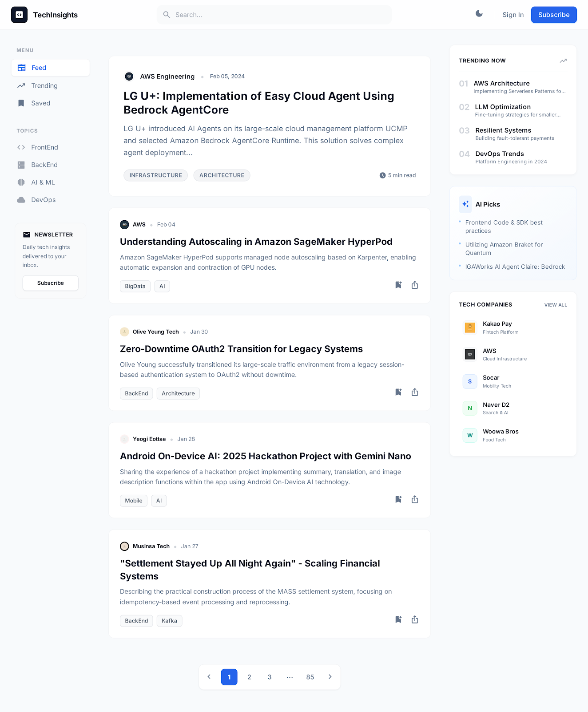
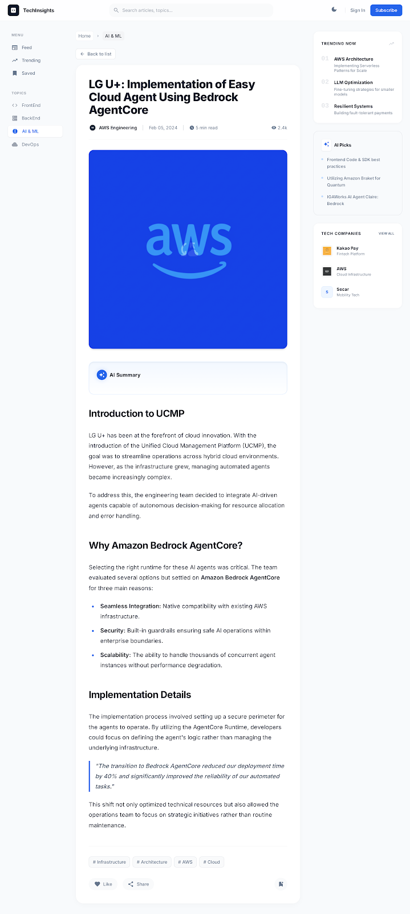

# Tech Insights Frontend

Tech Insights의 웹 프론트엔드 애플리케이션입니다.  
기술 블로그 콘텐츠를 탐색하기 쉽게 모아 보여주는 UI를 제공합니다.

## 주요 기능

- 피드 기반 게시글 목록 조회
- 카테고리/회사 단위 탐색
- 검색(즉시 검색 + 결과 페이지)
- 게시글 상세 보기
- 다크 모드 지원
- 반응형 레이아웃

## 기술 스택

- Next.js (App Router)
- React + TypeScript
- Tailwind CSS
- Axios

## 프로젝트 구조

```text
app/         # 라우팅 및 페이지
components/  # UI 컴포넌트
lib/         # 비즈니스/공통 로직
public/      # 정적 자산
docs/        # 문서 자산
```

## 시작하기

### 1) 의존성 설치

```bash
npm install
```

### 2) 환경 변수 설정

프로젝트 루트에 `.env.local` 파일을 만들고 아래 값을 설정하세요.

```env
NEXT_PUBLIC_API_URL=http://localhost:8080
```

### 3) 개발 서버 실행

```bash
npm run dev
```

## 사용 가능한 스크립트

```bash
npm run dev      # 개발 서버 실행
npm run build    # 프로덕션 빌드
npm run start    # 프로덕션 서버 실행
npm run lint     # ESLint 검사
```

## 스크린샷

### 메인 피드


### 게시글 상세

