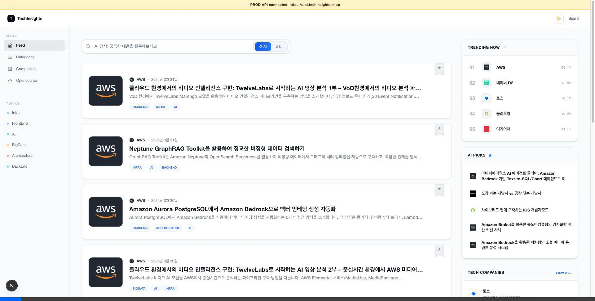
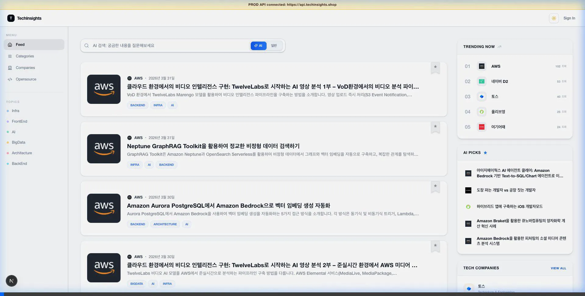
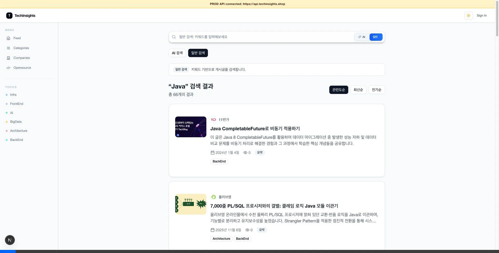
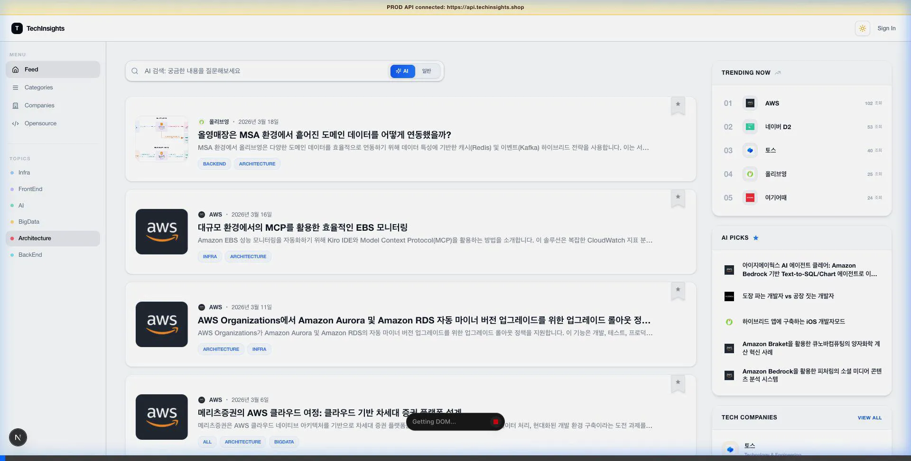
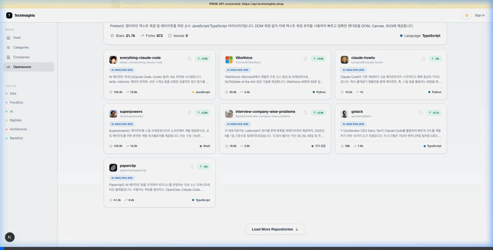
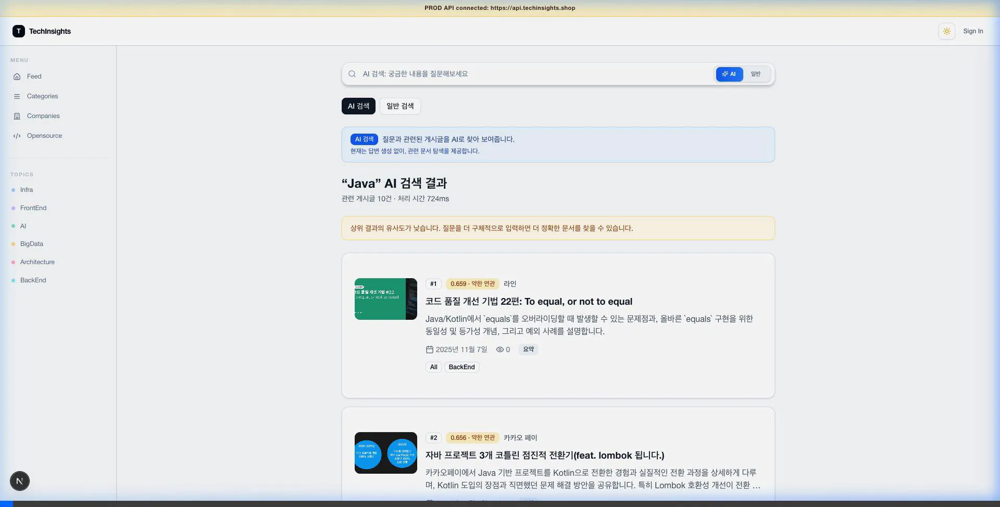

# Tech Insights Frontend

Tech Insights의 웹 프론트엔드 애플리케이션입니다.  
기술 블로그 콘텐츠를 탐색하기 쉽게 모아 보여주는 UI를 제공합니다.

## 주요 기능

- 피드 기반 게시글 목록 조회
- 카테고리/회사 단위 탐색
- 검색(즉시 검색 + 결과 페이지)
- 게시글 상세 보기
- 다크 모드 지원
- 반응형 레이아웃

## 기술 스택

- Next.js (App Router)
- React + TypeScript
- Tailwind CSS
- Axios

## 프로젝트 구조

```text
app/         # 라우팅 및 페이지
components/  # UI 컴포넌트
lib/         # 비즈니스/공통 로직
public/      # 정적 자산
docs/        # 문서 자산
```

## 시작하기

### 1) 의존성 설치

```bash
npm install
```

### 2) 환경 변수 설정

프로젝트 루트에 `.env.local` 파일을 만들고 아래 값을 설정하세요.

```env
NEXT_PUBLIC_API_URL=http://localhost:8080
```

운영 API 연결 검증이 필요하면 `.env.local`을 바꾸는 대신 아래 스크립트를 쓰는 편이 안전합니다.

```bash
npm run dev:local-api
npm run dev:prod-api
```

`dev:prod-api`는 로컬 프런트가 `https://api.techinsights.shop`에 직접 붙습니다. 이때 화면 상단에 운영 API 연결 배너가 표시됩니다.
이 배너는 `dev:prod-api` 스크립트에서만 뜨고, 실제 운영 배포에서는 표시되지 않습니다.

인증 기능까지 확인하려면 운영 백엔드에서 `http://localhost:3000`에 대한 CORS + credential 쿠키 설정이 허용되어 있어야 합니다.

### 3) 개발 서버 실행

```bash
npm run dev
```

## 사용 가능한 스크립트

```bash
npm run dev      # 개발 서버 실행
npm run dev:local-api  # 로컬 API로 개발 서버 실행
npm run dev:prod-api   # 운영 API로 개발 서버 실행
npm run build    # 프로덕션 빌드
npm run start    # 프로덕션 서버 실행
npm run lint     # ESLint 검사
```

## 화면 데모

### 메인 피드 및 게시글 탐색
메인 피드에서는 필터링과 무한 스크롤을 통한 기술 블로그 탐색이 가능합니다.


### 게시글 상세 보기
게시글의 상세 내용을 가독성 있게 최적화된 레이아웃으로 확인할 수 있습니다.


### 검색 기능 (일반/AI 검색)
키워드 검색 및 AI 기반 의미 검색을 지원합니다.


### 회사별 탐색
특정 회사의 기술 블로그만 모아서 볼 수 있습니다.


### 오픈소스 트렌드
최신 오픈소스 트렌드와 분석 내용을 확인할 수 있습니다.


### 주요 기능 (카테고리, 북마크, 프로필, 설정)
카테고리별 탐색, 북마크 관리, 프로필 관리 및 다크 모드 설정을 지원합니다.

